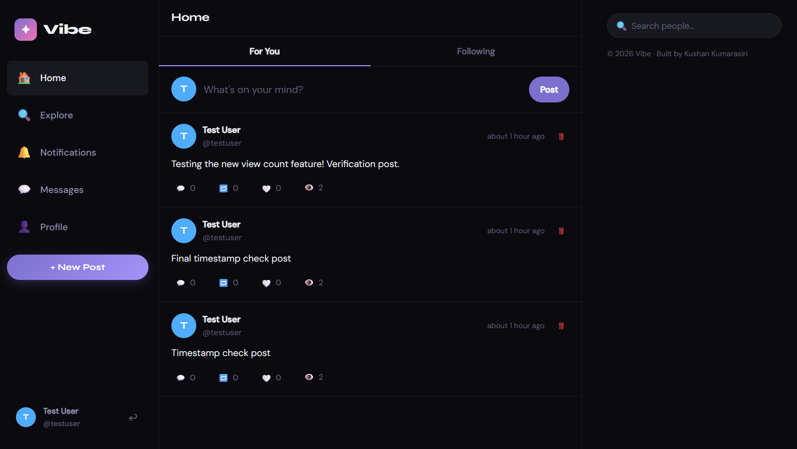
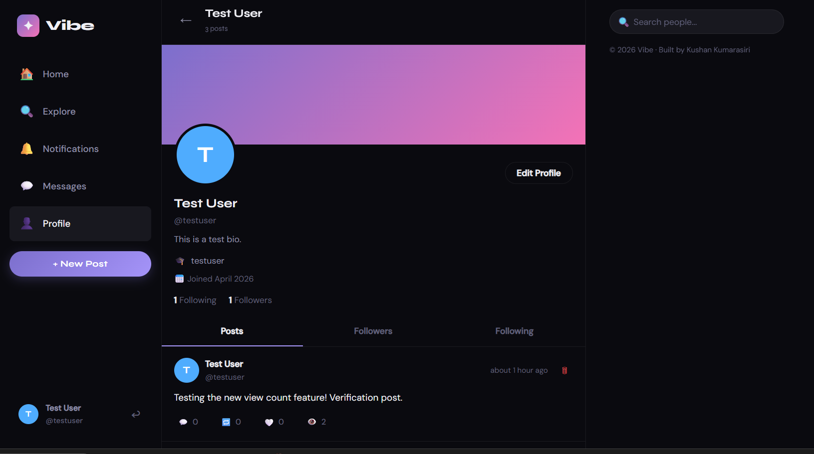
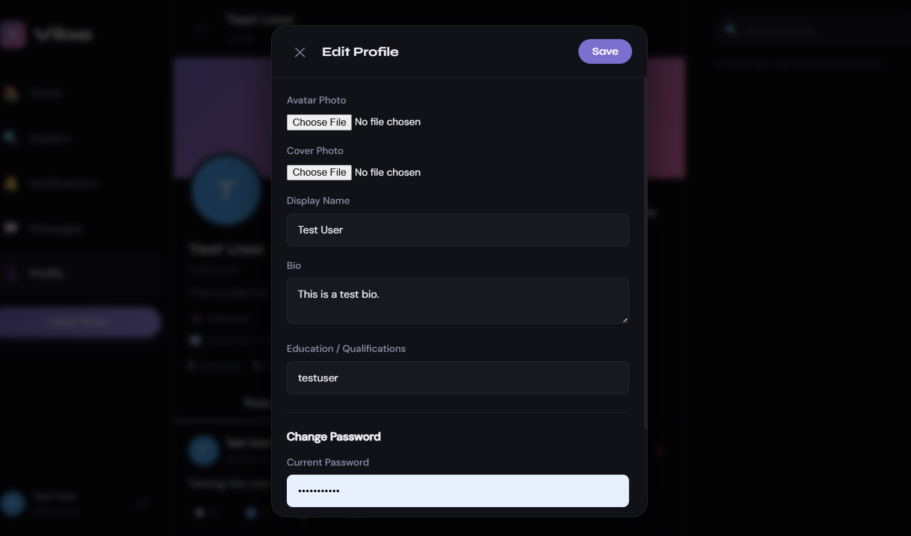
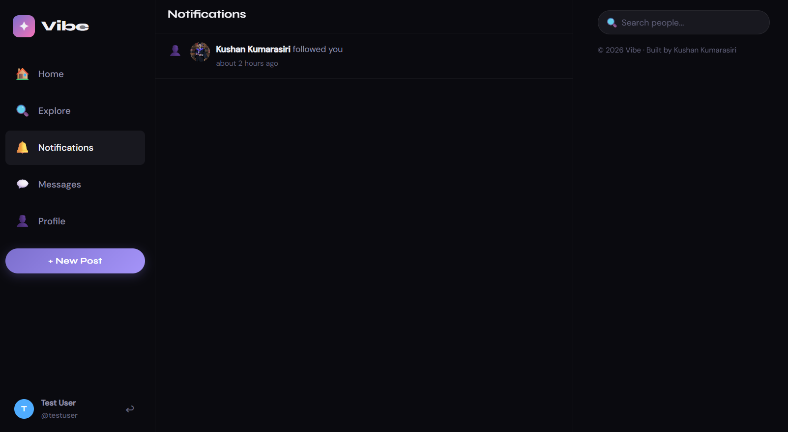
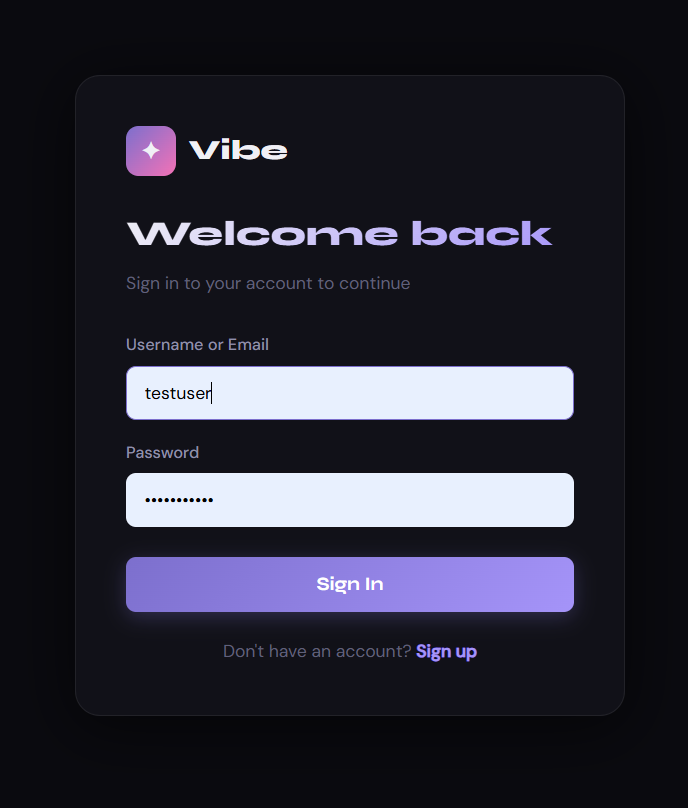
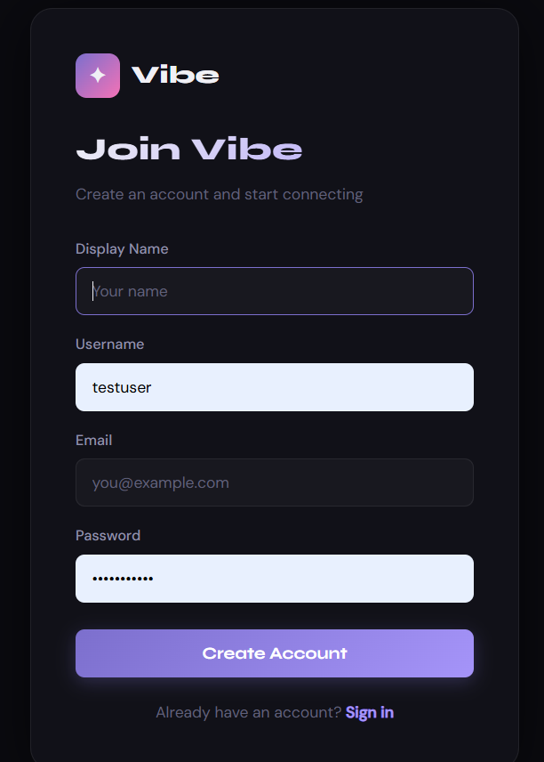

# ✦ Vibe — Social Media Platform

> A full-stack social networking application built with React, Node.js/Express, SQLite, and a native React Native (Expo) mobile app.

---

## 👤 Author

**Kushan Kumarasiri**
📧 [kushanlaksitha32@gmail.com](mailto:kushanlaksitha32@gmail.com)

---

## 📖 Description

**Vibe** is a modern, full-stack social media platform that enables users to connect, share, and communicate in real time — across both web and mobile. The platform supports core social networking features including user authentication, post creation with visibility controls, likes, comments, threaded replies, reposts, direct messaging, and push notifications. Designed with a dark-themed UI, end-to-end media encryption, and native screenshot prevention, Vibe demonstrates modern full-stack engineering, state management, and cross-platform app development.

---

## 🚀 Features

### 🌐 Web Application
- 🔐 **User Authentication & Security** — Register, login, JWT-based sessions, and secure password changes
- 📝 **Rich Posts** — Create, view, and delete posts with photo and video upload support
- 🔏 **Post Visibility Control** — Set each post to **Public** 🌐, **Followers Only** 👥, or **Only Me** 🔒 before publishing
- ❤️ **Engagement** — Like posts, track unique post views (👁️), and see live count updates
- 💬 **Comments & Replies** — Threaded reply system on any post
- 🔁 **Reposts** — Share any post to your followers
- 👥 **Follow System** — Follow/unfollow users; view detailed followers/following lists on profiles
- 💌 **Private Chat** — Direct messaging between users with unread message indicators
- 🔔 **Notifications** — Like, reply, follow, and repost notifications with mark-all-as-read
- 🏠 **Smart Feed** — Following feed that respects each post's visibility setting
- 🔍 **Explore** — Browse public trending posts; search for users by name or username
- 👤 **Enhanced Profiles** — Custom avatars and cover photos, full-size image viewer, bio, educational qualifications, and detailed follower/following/post stats
- 📽️ **Stories** — Share photos and videos (up to 1 minute) that disappear after 24 hours; view active stories from users you follow
- 🌟 **Highlights** — Save and group your favorite old stories as highlights on your profile page
- 🚫 **Blocking System** — Block users to prevent interaction; manage blocked users in Settings to unblock them
- 🛡️ **Media Privacy** — Server-side AES encryption for all uploaded images/videos; raw files never stored in plaintext on disk
- 📵 **Screenshot Deterrents** — Right-click disabled on media; `PrintScreen` and window-blur events blur the entire app to deter screen capture tools
- 📱 **Responsive UI** — Works flawlessly on desktop, tablet, and mobile browsers

### 📱 Mobile Application (React Native / Expo)
- 🔐 **Secure Auth** — Login and Register with JWT stored in the device's secure encrypted storage (`expo-secure-store`)
- 🏠 **Home Feed** — Pull-to-refresh feed of posts from followed users
- 🔍 **Explore** — Trending public posts with search bar
- 💬 **Post Details & Replies** — View a post and all replies; write and submit a reply
- ➕ **Create Post** — Select images or videos from the device gallery using the native picker; set post visibility before publishing
- 🔏 **Visibility Selector** — Choose **Public** / **Followers** / **Only Me** using styled chip buttons on the compose screen
- 👤 **Profile Screen** — View any user's profile, their stats, and posts; own profile shows a Logout button
- 💌 **Messages** — List of all conversations with unread badge counts; open any conversation to read and send messages
- 🔔 **Notifications** — Like, reply, follow, and repost notifications with mark-all-as-read
- 📵 **Native Screenshot Blocking** — Uses `expo-screen-capture` to ask the Android/iOS OS to **block all screenshots and screen recordings** at the system level (screen appears black when captured)
- 🎨 **Dark Mode UI** — Consistent dark Vibe aesthetic with green accent (`#00e676`) and smooth interactions

---

## 🔒 Post Visibility System

Each post can be set to one of three visibility levels **before publishing**, on both Web and Mobile:

| Icon | Value | Who Can See |
|------|-------|-------------|
| 🌐 | `public` | Everyone, including the Explore page |
| 👥 | `followers` | Only users who follow you |
| 🔒 | `onlyme` | Only you (the author) |

**Enforcement rules:**
- `GET /api/posts/explore` → returns **only `public`** posts
- `GET /api/posts/feed` → returns your own posts + followed users' posts excluding their `onlyme` posts
- `GET /api/posts/user/:id` → returns all posts if it's your own profile; `onlyme` excluded for followers; only `public` for strangers
- `GET /api/posts/:id` → returns a `403 Forbidden` if a non-author tries to access an `onlyme` post, or a `followers` post without following the author

Every post card displays a small visibility icon (🌐 / 👥 / 🔒) next to the timestamp so authors can always see who can view their content.

---

## 📵 Screenshot & Screen Recording Prevention

| Platform | Method | Effect |
|----------|--------|--------|
| **Mobile (Android/iOS)** | `expo-screen-capture` — `preventScreenCaptureAsync()` | OS blocks all screenshots and screen recordings; captured image appears **solid black** |
| **Web — Right-click** | `contextmenu` event listener disabled on `` and `<video>` | Prevents "Save Image As" from the browser context menu |
| **Web — PrintScreen key** | `keydown` event listener | Blurs the entire app for 1 second when `PrintScreen` is pressed |
| **Web — Window blur** | `window.blur` / `window.focus` events | App blurs whenever the browser loses focus (e.g., user switches to a screen capture tool) |
| **Web — CSS** | `user-select: none`, `-webkit-user-drag: none` | Prevents drag-and-drop saving and text selection on media |

> **Note:** 100% screenshot prevention on the web is not achievable due to browser security sandboxing. The measures above deter casual capture; OS-level tools (e.g., OBS) cannot be blocked by a web page.

---

## 🛠 Tech Stack

| Layer | Technology |
|-------|------------|
| Web Frontend | React 18, React Router v6, Axios |
| Mobile App | React Native (Expo SDK 54), Expo Router |
| Backend | Node.js, Express.js |
| Database | SQLite (`node:sqlite` built-in) |
| Auth | JWT (`jsonwebtoken`), `bcryptjs` |
| Media Security | AES-256 encryption (`crypto` module) |
| Screenshot Prevention (Mobile) | `expo-screen-capture` |
| Screenshot Prevention (Web) | JS event listeners + CSS |
| Mobile Storage | `expo-secure-store` (encrypted key-value) |
| Image Picker (Mobile) | `expo-image-picker` |
| Navigation (Mobile) | `@react-navigation/native`, `@react-navigation/bottom-tabs`, `@react-navigation/native-stack` |
| Fonts (Web) | Syne (display), DM Sans (body) — Google Fonts |
| Styling (Web) | Custom CSS with CSS Variables |

---

## 📁 Project Structure

```
social-app/
├── backend/
│   ├── db/
│   │   └── database.js         # SQLite schema, connection & migrations
│   ├── middleware/
│   │   └── auth.js             # JWT auth middleware
│   ├── routes/
│   │   ├── auth.js             # Register, login, profile update
│   │   ├── users.js            # Follow, search, suggestions
│   │   ├── posts.js            # CRUD, likes, reposts, replies, visibility
│   │   ├── chat.js             # Conversations & messages
│   │   └── notifications.js    # Notifications
│   ├── utils/
│   │   └── encryption.js       # AES-256 media encrypt/decrypt
│   ├── uploads/                # Encrypted media files (.enc)
│   ├── server.js               # Express app entry point
│   └── package.json
│
├── frontend/
│   ├── public/
│   │   └── index.html
│   ├── src/
│   │   ├── components/
│   │   │   ├── Sidebar.js          # Navigation sidebar
│   │   │   ├── PostCard.js         # Post display with visibility icon
│   │   │   ├── ComposeModal.js     # New post / reply modal with visibility selector
│   │   │   └── RightPanel.js       # Search & follow suggestions
│   │   ├── context/
│   │   │   └── AuthContext.js      # Global auth state
│   │   ├── pages/
│   │   │   ├── Home.js             # Following feed
│   │   │   ├── Explore.js          # Trending public posts
│   │   │   ├── Profile.js          # User profile
│   │   │   ├── PostDetail.js       # Single post + replies
│   │   │   ├── Messages.js         # Chat interface
│   │   │   ├── Notifications.js    # Notifications list
│   │   │   ├── Login.js
│   │   │   └── Register.js
│   │   ├── utils/
│   │   │   └── api.js              # Axios instance with JWT interceptor
│   │   ├── App.js                  # Routes, layout & screenshot deterrents
│   │   ├── index.js                # React entry point
│   │   └── index.css               # Global styles & design system
│   └── package.json
│
├── mobile/                         # React Native (Expo) app
│   ├── src/
│   │   ├── components/
│   │   │   └── Post.js             # Reusable post card with visibility icon
│   │   ├── context/
│   │   │   └── AuthContext.js      # Auth state & secure token storage
│   │   ├── navigation/
│   │   │   └── AppNavigator.js     # Tab + stack navigation
│   │   ├── screens/
│   │   │   ├── LoginScreen.js
│   │   │   ├── RegisterScreen.js
│   │   │   ├── HomeScreen.js       # Following feed with pull-to-refresh
│   │   │   ├── ExploreScreen.js    # Trending posts & search
│   │   │   ├── ProfileScreen.js    # User profile + posts
│   │   │   ├── PostDetailScreen.js # Single post + reply input
│   │   │   ├── CreatePostScreen.js # Compose post with visibility selector & media picker
│   │   │   ├── MessagesScreen.js   # Conversations list
│   │   │   ├── ChatScreen.js       # Individual chat window
│   │   │   └── NotificationsScreen.js
│   │   └── utils/
│   │       └── api.js              # Axios instance with JWT interceptor
│   ├── App.js                      # Root — screenshot prevention + providers
│   └── package.json
│
├── start.sh                    # One-command startup script (Linux/macOS)
├── start.bat                   # One-command startup script (Windows)
└── README.md
```

---

## ⚙️ Installation & Setup

### Prerequisites

- [Node.js](https://nodejs.org/) v18 or higher
- npm (comes with Node.js)
- [Expo Go](https://expo.dev/client) app on your phone (for mobile testing)

---

### Web Application

#### 1. Install backend dependencies

```bash
cd backend
npm install
```

#### 2. Install frontend dependencies

```bash
cd frontend
npm install
```

#### 3. Start the backend server

```bash
cd backend
npm start
# Server runs on http://localhost:5000
```

#### 4. Start the frontend (in a new terminal)

```bash
cd frontend
npm start
# App opens at http://localhost:3000
```

#### 5. Or use the one-command script

**Linux/macOS:**
```bash
chmod +x start.sh
./start.sh
```

**Windows:**
```bat
start.bat
```

---

### Mobile Application

#### 1. Install mobile dependencies

```bash
cd mobile
npm install
```

#### 2. Start the Expo development server

```bash
cd mobile
npx expo start
```

#### 3. Run on a device or emulator

| Option | Command | Notes |
|--------|---------|-------|
| Android Emulator | Press `a` in the terminal | Requires Android Studio |
| iOS Simulator | Press `i` in the terminal | Requires macOS + Xcode |
| Physical Device | Scan QR code with **Expo Go** app | Works on Android & iOS |

> **Android Emulator Note:** The API base URL is automatically set to `http://10.0.2.2:5000` for Android emulators to reach your local backend server.

---

## 🔌 API Endpoints

### Auth
| Method | Endpoint | Auth | Description |
|--------|----------|------|-------------|
| POST | `/api/auth/register` | ❌ | Register new user |
| POST | `/api/auth/login` | ❌ | Login |
| GET | `/api/auth/me` | ✅ | Get current user |
| PUT | `/api/auth/profile` | ✅ | Update profile |

### Posts
| Method | Endpoint | Auth | Description |
|--------|----------|------|-------------|
| GET | `/api/posts/feed` | ✅ | Following feed (respects visibility) |
| GET | `/api/posts/explore` | ❌ | Trending public posts |
| POST | `/api/posts` | ✅ | Create post or reply (send `visibility`) |
| GET | `/api/posts/:id` | optional | Get single post (enforces visibility) |
| GET | `/api/posts/:id/replies` | optional | Get replies |
| POST | `/api/posts/:id/like` | ✅ | Like / unlike |
| POST | `/api/posts/:id/repost` | ✅ | Repost / undo repost |
| DELETE | `/api/posts/:id` | ✅ | Delete own post |
| GET | `/api/posts/user/:userId` | optional | User's posts (filtered by visibility) |
| POST | `/api/posts/:id/view` | optional | Record unique post view |

### Users
| Method | Endpoint | Auth | Description |
|--------|----------|------|-------------|
| GET | `/api/users/search?q=` | optional | Search users |
| GET | `/api/users/suggestions` | ✅ | Who to follow |
| GET | `/api/users/:username` | optional | Get profile |
| POST | `/api/users/:id/follow` | ✅ | Follow / unfollow |
| GET | `/api/users/:id/followers` | ❌ | List followers |
| GET | `/api/users/:id/following` | ❌ | List following |
| POST | `/api/users/:id/block` | ✅ | Block / unblock user |
| GET | `/api/users/settings/blocked` | ✅ | List blocked users |

### Stories
| Method | Endpoint | Auth | Description |
|--------|----------|------|-------------|
| POST | `/api/stories` | ✅ | Upload a story (photo/video) |
| GET | `/api/stories/feed` | ✅ | Get active stories feed |
| GET | `/api/stories/user/:userId`| ✅ | Get all stories of a user |

### Highlights
| Method | Endpoint | Auth | Description |
|--------|----------|------|-------------|
| POST | `/api/highlights` | ✅ | Create a new highlight |
| GET | `/api/highlights/user/:userId`| ❌ | Get user's highlights |
| DELETE | `/api/highlights/:id` | ✅ | Delete a highlight |

### Chat
| Method | Endpoint | Auth | Description |
|--------|----------|------|-------------|
| GET | `/api/chat/conversations` | ✅ | List conversations |
| POST | `/api/chat/conversations/:userId` | ✅ | Start / get conversation |
| GET | `/api/chat/conversations/:id/messages` | ✅ | Get messages (marks as read) |
| POST | `/api/chat/conversations/:id/messages` | ✅ | Send message |

### Notifications
| Method | Endpoint | Auth | Description |
|--------|----------|------|-------------|
| GET | `/api/notifications` | ✅ | Get all notifications |
| POST | `/api/notifications/read` | ✅ | Mark all as read |

### Media
| Method | Endpoint | Auth | Description |
|--------|----------|------|-------------|
| GET | `/api/media/:filename` | ❌ | Serve decrypted media (AES-256) |

---

## 🗄 Database Schema

The SQLite database (`backend/db/social.db`) is auto-created on first run. If a column is added in an update (e.g., `visibility`), an `ALTER TABLE` migration runs automatically without losing data.

| Table | Key Columns |
|-------|------------|
| `users` | id, username, display_name, email, password (hashed), bio, avatar, cover, followers_count, following_count, posts_count, education |
| `follows` | follower_id → users, following_id → users |
| `posts` | id, user_id, content, image, video, visibility (`public`/`followers`/`onlyme`), likes_count, comments_count, reposts_count, views_count, parent_id (replies), repost_of, is_reply |
| `likes` | user_id, post_id |
| `reposts` | user_id, post_id |
| `post_views` | post_id, user_id (unique per user) |
| `conversations` | id, user1_id, user2_id, last_message, last_message_at |
| `messages` | id, conversation_id, sender_id, content, read |
| `notifications` | id, user_id, actor_id, type (like/follow/reply/repost), post_id, read |

---

## 🔒 Environment Variables

Create a `.env` file in `backend/`:

```env
PORT=5000
JWT_SECRET=your_super_secret_key_here
ENCRYPTION_KEY=your_32_char_hex_encryption_key
```

---

## 📸 UI Overview

### Web Application
- **Dark theme** with a purple/violet accent palette
- **Syne** display font for headings | **DM Sans** for body text
- Three-column layout: Sidebar navigation | Main feed | Right panel (search & suggestions)
- Responsive down to mobile with collapsible sidebar

### Mobile Application
- **Dark theme** with green accent (`#00e676`)
- Bottom tab navigation: Home | Explore | Notifications | Messages | Profile
- Full-screen compose modal with visibility selector chips and native image/video picker

### Screenshots

**Home Feed**


**User Profile**


**Edit Profile**


**Notifications**


**Login & Register**
<p float="left">
  
  
</p>

---

## 📄 License

MIT License — Free to use, modify, and distribute.

---

*Built with ❤️ by Kushan Kumarasiri*
